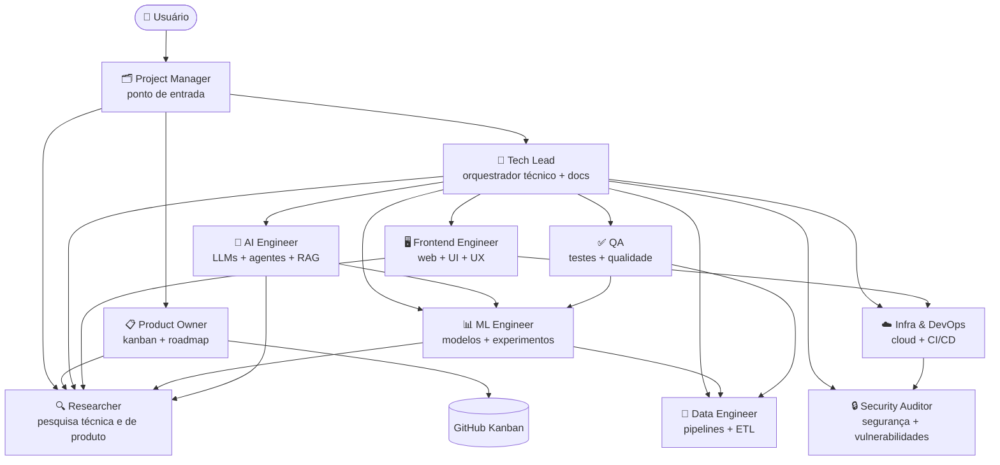

# Claude Code Kanban Template

Template base para novos projetos Python com Claude Code configurado, equipe multi-agentes e kanban no GitHub Projects.

## O que este template entrega

- **11 agentes especializados** com papéis claros e sem sobreposição de responsabilidades
- **Kanban no GitHub Projects** configurado automaticamente via workflow
- **`/wizard`** para criar novos repositórios a partir do template com um comando
- **Permissões granulares** — agentes operam sem prompts desnecessários, com operações destrutivas bloqueadas
- **Templates de `CLAUDE.md` e `AGENTS.md`** gerados por projeto ao criar via wizard

---

## Arquitetura Multi-Agentes



---

## Equipe de Agentes

| Agente | Responsabilidade |
|---|---|
| `project-manager` | Ponto de entrada — delega, consolida resultados, apresentações e relatórios |
| `tech-lead` | Orquestrador técnico, code review, dono da documentação técnica |
| `product-owner` | Kanban, backlog, roadmap, priorização |
| `data-engineer` | Pipelines, ETL, qualidade de dados |
| `ml-engineer` | Modelos, features, experimentos |
| `ai-engineer` | LLMs, agentes, RAG, evals |
| `infra-devops` | Cloud, CI/CD, containers |
| `qa` | Testes unitários, integração, e2e |
| `researcher` | Pesquisa técnica e de produto, benchmarks, inteligência competitiva |
| `security-auditor` | Segurança, vulnerabilidades |
| `frontend-engineer` | Web, UI, UX |

Cada agente pode spawnar **subagentes efêmeros** para tarefas que exigem isolamento de contexto — exploração de dados desconhecidos, segunda opinião técnica independente, hipóteses concorrentes de pesquisa, etc. Os subagentes existem apenas durante a tarefa e são descartados ao terminar.

---

## Estrutura de Arquivos

```text
.claude/
  agents/                    # definições dos 11 agentes
  commands/
    review.md                # /review — code review orquestrado
    deploy.md                # /deploy — checklist de deploy
    fix-issue.md             # /fix-issue — correcao de bug
  settings.json              # permissoes e hooks
scripts/
  new_repo.py                # script de criacao de repositorio
  templates/
    CLAUDE.md                # template de CLAUDE.md para novos projetos
    AGENTS.md                # template de AGENTS.md para novos projetos
.github/
  workflows/
    setup-kanban.yml         # configura GitHub Projects automaticamente
src/
tests/
notebooks/
pyproject.toml
CLAUDE.md
CLAUDE.local.md.example
.mcp.json.example
.gitignore
AGENTS.md
```

---

## Como Criar um Novo Projeto

### Via wizard (recomendado)

Em uma conversa nova neste projeto, use:

```
/wizard
```

O wizard vai:
1. Perguntar nome, visibilidade e se instalar skills Caveman
2. Verificar se a pasta local já existe
3. Criar o repositório no GitHub
4. Clonar localmente
5. Configurar o secret `GH_PAT` (use um PAT dedicado com escopo mínimo: `repo`, `project`, `read:org`)
6. Disparar a workflow `Setup Kanban`
7. Limpar arquivos de template e gerar `CLAUDE.md` e `AGENTS.md` específicos do projeto

### Via script direto

```bash
python scripts/new_repo.py --name <nome> --visibility private --yes
```

Flags úteis:
- `--yes` — confirma tudo sem prompts
- `--skip-clone` — cria apenas no GitHub sem pasta local
- `--caveman` / `--skip-caveman` — instala ou pula as skills Caveman

### Via GitHub (manual)

1. Clique em **Use this template** no GitHub e crie um novo repositório
2. Adicione o secret `GH_PAT` no repositório novo
3. Rode a workflow `Setup Kanban` manualmente
4. Valide:
   - existe um project com nome `<repo> Kanban`
   - o project aparece na aba `Projects` do repositório
   - existem as views `Board`, `Table` e `Done`
   - a issue `Getting Started` existe no project com status `Todo`

---

## Fluxo de Kanban

O kanban é a fonte de verdade. Todos os agentes consultam antes de agir.

| Papel | Agente | Permissões |
|---|---|---|
| Dono | `product-owner` | cria, fecha, move qualquer card, árbitro final |
| Leitor obrigatório | `project-manager` | lê antes de toda delegação |
| Criador de issues | `project-manager`, `product-owner` | abrem issues novas |
| Atualizador | todos os especialistas | move o próprio card para `In Progress` e `In Review` |
| Fechador | `product-owner` + `tech-lead` | movem para `Done` após aprovação |

---

## Fluxo de Código e PR

| Etapa | Responsável |
|---|---|
| Escrever código | agente especialista da tarefa |
| Abrir PR | agente especialista que implementou |
| Code review | `tech-lead` — sempre |
| Security review | `security-auditor` — PRs com infra, auth ou dados sensíveis |
| QA review | `qa` — valida cobertura de testes |
| Aprovar PR | `tech-lead` |
| Merge | `tech-lead`; `infra-devops` em PRs de CI/CD quando delegado |
| Fechar issue | `product-owner` após merge |

Regra central: **nenhum agente faz merge do próprio trabalho sem aprovação do `tech-lead`**.

---

## Ferramentas Disponíveis

Os agentes têm acesso sem prompt de permissão a:

| Ferramenta | Cobertura |
|---|---|
| `Bash(git:*)` | Todos os comandos git (exceto force push e reset hard) |
| `Bash(gh:*)` | Todos os comandos gh CLI — issues, PRs, projects, workflows (exceto operações destrutivas) |
| `Bash(python/pytest/ruff/black/pip/uv:*)` | Desenvolvimento Python completo |
| `WebSearch` / `WebFetch` | Pesquisa web e leitura de URLs |
| MCP GitHub | Leitura e escrita de issues, PRs, branches, reviews |

Operações permanentemente bloqueadas: `git push --force`, `git reset --hard`, `git clean -f`, `gh repo delete`, `gh secret set/delete`, `gh auth login/token`, `gh ssh-key add`.

---

## Slash Commands

| Comando | O que faz |
|---|---|
| `/wizard` | Cria novo repositório a partir do template |
| `/review` | Dispara `tech-lead` e `security-auditor` em paralelo e consolida relatório |
| `/fix-issue` | Identifica causa raiz e aplica correção mínima |
| `/deploy` | Checklist de deploy |

---

## CI

Todo PR roda automaticamente:
- `ruff check`
- `black --check`
- `pytest`

---

## Arquivos Locais

| Arquivo | Propósito |
|---|---|
| `.mcp.json` | Configuração local dos MCP servers — **não commitar** |
| `CLAUDE.local.md` | Preferências pessoais locais — **não commitar** |
| `.claude/settings.local.json` | Overrides locais de permissões — **não commitar** |

---

## Observações

- No primeiro push do repo criado a partir do template, a workflow pode rodar antes de `GH_PAT` existir. Nessa situação ela cria labels e issue inicial e pula a criação do project. Depois que `GH_PAT` for configurado, rode `Setup Kanban` manualmente.
- A API atual do GitHub permite criar a view `Board`, mas o agrupamento visual por `Status` ainda pode exigir ajuste manual na interface.
- Para projetos que usam Docker, Terraform, npm ou conda, adicione as permissões correspondentes no `settings.json` do projeto — elas não estão no template por serem projeto-específicas.
