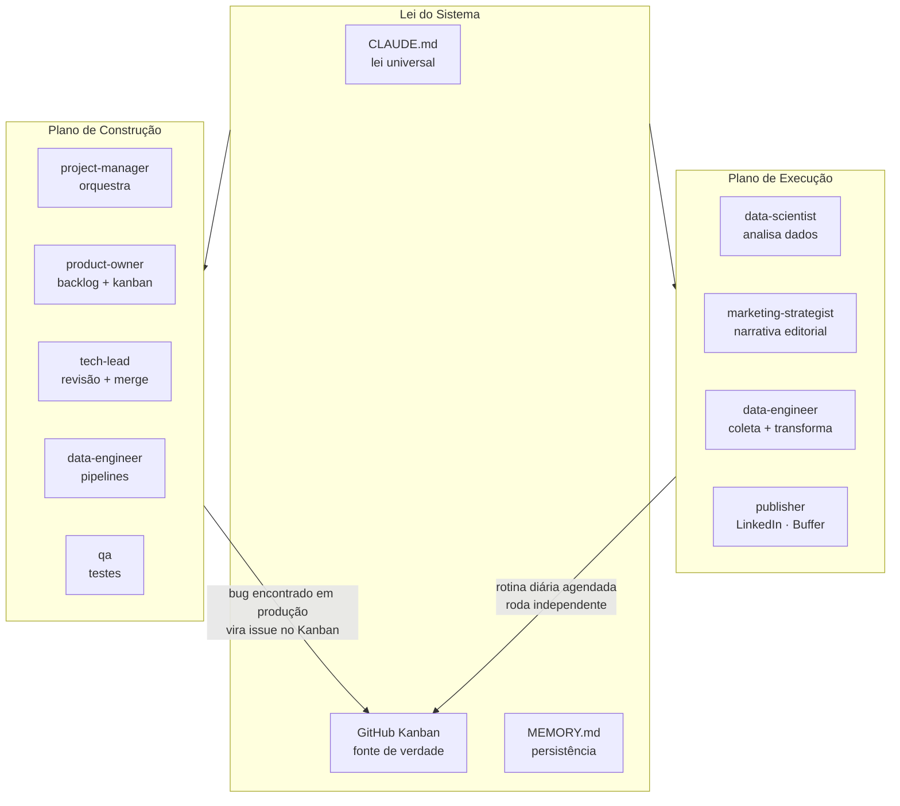
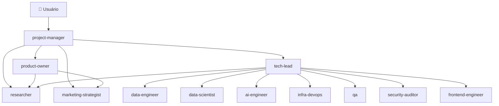
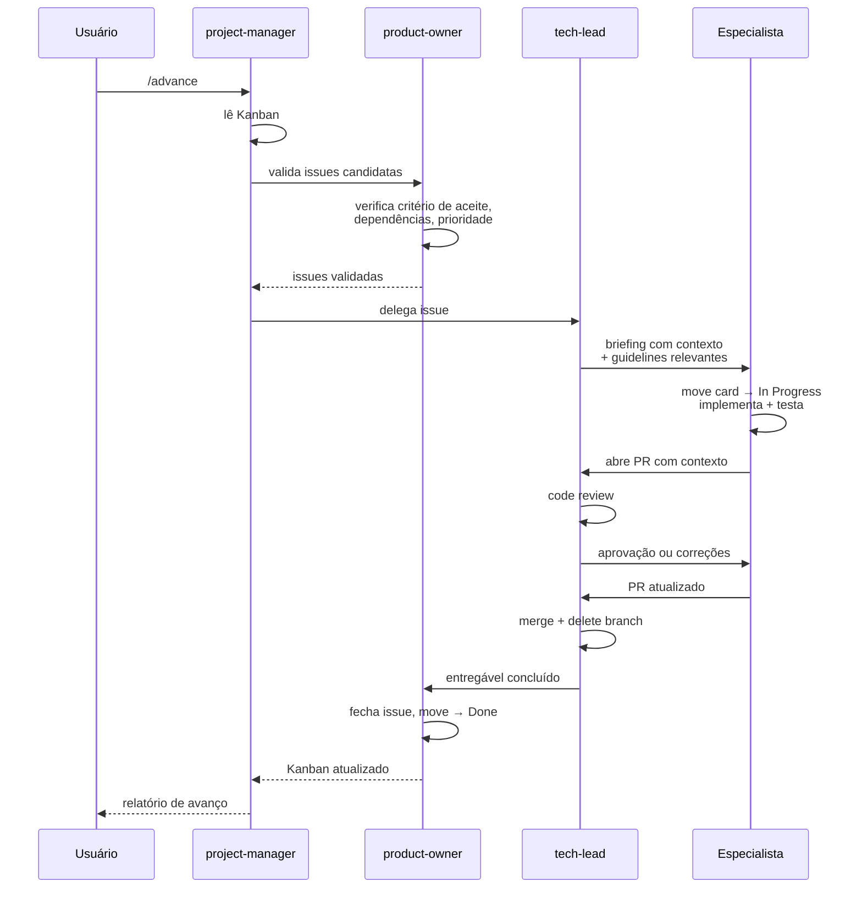
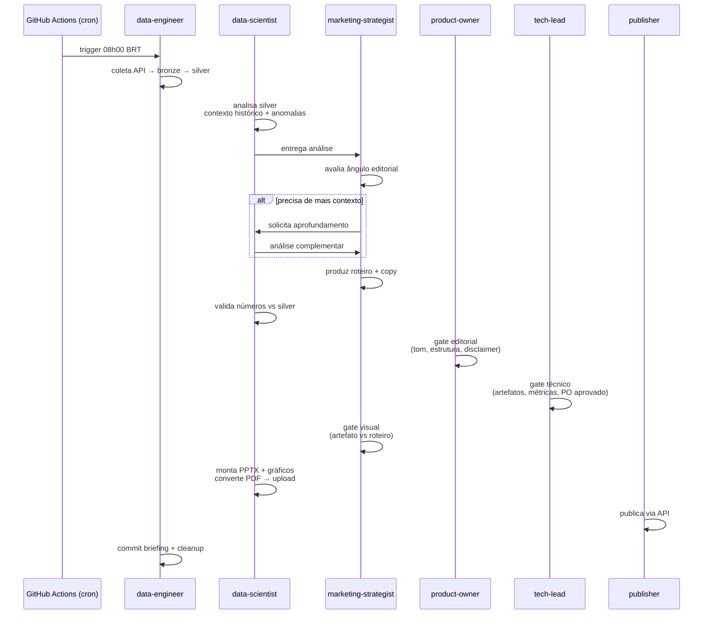
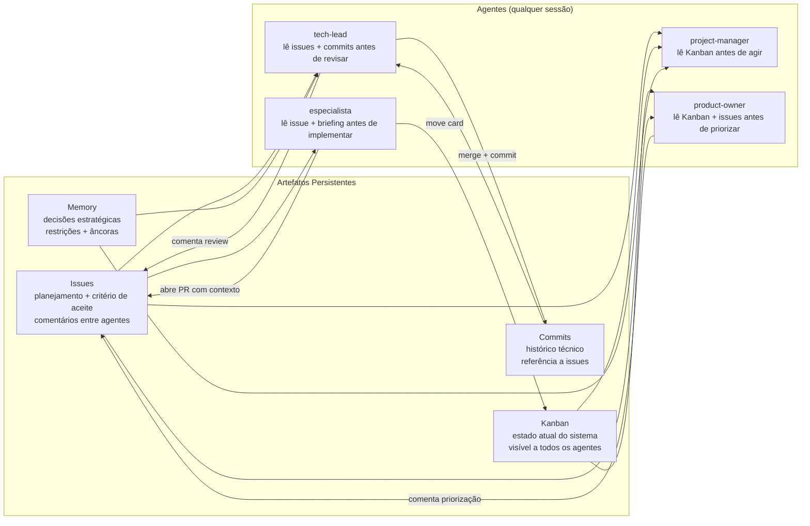

# Dual Multi-Agent System — Arquitetura e Origem

*Como a maturidade dos modelos de linguagem e a convergência de ferramentas tornaram possível um padrão inédito de orquestração: o mesmo time de agentes construindo e executando o produto simultaneamente.*

---

## O passado recente: overhead, fragilidade e o teto dos poucos agentes

Em 2023 e início de 2024, sistemas multi-agentes com LLMs existiam principalmente como demonstrações acadêmicas e protótipos de laboratório. Frameworks como LangChain, AutoGen e CrewAI ofereciam as abstrações — cadeias de chamadas, memória de curto prazo, ferramentas plugáveis, roteamento entre agentes. O entusiasmo era genuíno. A prática era frustrante.

O problema central não era conceitual. Era que cada camada de complexidade adicionada ao pipeline multiplicava os pontos de falha de forma não linear. Um agente executando uma tarefa simples — buscar dados, gerar um resumo, formatar uma resposta — funcionava com razoável confiabilidade. Dois agentes trocando informação já introduzia problemas de formato de output, de contexto perdido entre chamadas, de instruções que o segundo agente interpretava diferente do esperado. Com mais agentes, o sistema passava mais tempo gerenciando falhas do que produzindo resultado.

O teto prático era **poucos agentes resolvendo apenas tarefas simples e bem delimitadas**. Text-to-SQL funcionava porque o output é verificável — você roda a query e vê se retorna o que deveria. RAG funcionava porque recuperar documentos relevantes e sintetizar uma resposta tem um espaço de erro relativamente contido. Mas pipelines criativos, intelectuais, editoriais — onde o output é subjetivo, onde um agente precisa *reagir* ao raciocínio de outro e não apenas receber seu output formatado — esses não funcionavam de forma confiável.

Além da capacidade dos modelos, havia o custo de construção. Para orquestrar cinco agentes com LangChain, você escrevia um orquestrador Python, um gerenciador de estado, lógica de retry, parsers de output customizados para cada agente, e ainda assim passava boa parte do tempo depurando comportamentos emergentes do framework — não do problema que queria resolver. O overhead de engenharia era proibitivo para times pequenos ou projetos individuais.

---

## A virada: modelos que seguem instruções e uma arquitetura que convergiu

Dois eventos independentes mudaram o quadro entre meados de 2024 e 2025.

O primeiro foi a maturidade dos modelos. O Claude 3.5 Sonnet foi amplamente reconhecido pelos practitioners como o primeiro modelo genuinamente confiável para pipelines agênticos complexos — não porque fosse perfeito, mas porque seguia instruções longas com fidelidade suficiente para que um pipeline de múltiplos estágios funcionasse sem supervisão constante. Ele conseguia manter contexto do que um agente anterior havia produzido, raciocinar sobre esse output (e não apenas reformatá-lo), e saber quando pedir mais informação antes de avançar. Os modelos subsequentes consolidaram essa capacidade.

O segundo evento foi a convergência de uma arquitetura. De forma independente, as principais ferramentas do ecossistema chegaram à mesma estrutura fundamental para definir e operar agentes:

```
SOUL.md / CLAUDE.md / AGENTS.md    →  identidade, valores, regras de comportamento
agents/<nome>.md                   →  definição de cada agente especializado
MEMORY.md + arquivos de memória    →  persistência entre sessões
skills/<nome>/SKILL.md             →  workflows reutilizáveis e nomeados
hooks (session_start, post_write)  →  automação orientada a eventos
MCP servers                        →  conexão com ferramentas e sistemas externos
rotinas / cron                     →  execução agendada sem intervenção humana
```

O **OpenClaw** — que surgiu em novembro de 2025 e se tornou o repositório open-source de crescimento mais rápido da história do GitHub — usa `SOUL.md` para identidade, `AGENTS.md` para regras procedurais, `MEMORY.md` para persistência, e `skills/` para workflows. O **Codex** da OpenAI usa `AGENTS.md` hierárquico por diretório, `SKILL.md` para workflows, e hooks configuráveis via `config.toml`. O **Claude Code** usa `CLAUDE.md`, `.claude/agents/*.md`, `.claude/memory/`, `commands/*.md` como skills, e hooks em `settings.json`.

Os nomes dos arquivos diferem. A arquitetura é a mesma.

| Conceito | Claude Code | OpenClaw | Codex (OpenAI) |
|---|---|---|---|
| Identidade do agente | `CLAUDE.md` | `SOUL.md` + `AGENTS.md` | `AGENTS.md` |
| Agentes especializados | `.claude/agents/*.md` | `agents/<nome>.md` | subagents |
| Memória persistente | `MEMORY.md` + arquivos | `MEMORY.md` + SQLite | não nativo |
| Hooks | `settings.json` | `gateway:startup`, `agent:bootstrap` | `config.toml` |
| Skills / workflows | `commands/*.md` | `skills/SKILL.md` | `SKILL.md` + scripts |
| Multi-agente | `Task` tool | multi-agent routing | subagents SDK |
| Rotinas agendadas | GitHub Actions + CronCreate | cron nativo | triggers externos |

!!! note "Por que a convergência importa"
    Quando múltiplos times independentes chegam à mesma estrutura sem coordenação prévia, isso é sinal de que a estrutura é correta — não uma convenção arbitrária, mas uma solução que emergiu das restrições reais do problema. Arquivos markdown como lei do agente, memória persistente separada do contexto de sessão, skills como unidade de workflow reutilizável, hooks para automação reativa — esses padrões sobreviveram ao teste de produção em sistemas muito diferentes.

O resultado prático dessa convergência foi a eliminação do overhead de framework. Em vez de escrever um orquestrador Python que coordena agentes via API, você escreve um arquivo markdown que define quem o agente é, o que ele faz, a quem responde, e quais são suas regras invioláveis. O modelo lê esse arquivo e age de acordo. A orquestração acontece em linguagem natural, não em código imperativo.

Isso colapsou o custo de construção de semanas para dias. E abriu espaço para um padrão que não era viável antes.

---

## O padrão dual: dois planos, um sistema, uma lei

Com o overhead eliminado e modelos capazes de seguir instruções complexas com fidelidade, tornou-se possível fazer algo que nenhuma ferramenta havia planejado explicitamente: usar o mesmo time de agentes para *construir* o produto e para *ser* o produto simultaneamente.

Este é o **Dual Multi-Agent System**.



**No plano de construção**, os agentes desenvolvem o produto. Eles abrem issues, escrevem código, fazem code review, evoluem o backlog, tomam decisões de arquitetura, escrevem testes, fazem deploy. O `project-manager` orquestra, o `tech-lead` revisa e aprova, o `product-owner` mantém o Kanban como fonte de verdade. Este plano é governado por comandos como `/kickoff`, `/advance`, `/fix-issue`, `/review`.

**No plano de execução**, os agentes *são* o produto. Eles rodam rotinas agendadas, coletam dados de APIs externas, transformam e analisam, produzem artefatos (PPTX, PDF, gráficos), escrevem copy editorial, publicam em redes sociais, rastreiam métricas de engajamento. Este plano é governado por comandos como `/run-editorial-diaria`, rotinas semanais e mensais, triggers de GitHub Actions em horários fixos.

O que torna o padrão dual poderoso não é a existência dos dois planos separados — é que eles compartilham a mesma infraestrutura de governança. O mesmo `CLAUDE.md` define as regras de comportamento para o `data-scientist` quando ele está analisando dados de produção e para o `data-engineer` quando ele está implementando uma nova feature. O mesmo Kanban registra tanto a issue de melhoria técnica aberta pelo `tech-lead` quanto o evento de execução registrado pela rotina diária. A mesma memória persistente informa tanto as decisões de produto quanto as decisões editoriais.

---

## Papéis, cadeia de comando e interações permitidas

Um sistema com muitos agentes só funciona de forma confiável se cada agente sabe exatamente três coisas: o que é seu papel, a quem responde, e com quem pode interagir diretamente. Sem essa clareza, o sistema degenera — agentes assumem responsabilidades de outros, tomam decisões que não são suas, criam dependências circulares, ou simplesmente ficam paralisados sem saber quem deve agir.

No padrão dual, cada agente tem um papel único e não intercambiável, definido no seu arquivo `.claude/agents/<nome>.md` e reforçado pelo `CLAUDE.md`:

| Agente | Papel | Nunca faz |
|---|---|---|
| `project-manager` | Ponto de entrada. Lê Kanban, delega, consolida, reporta. | Executa trabalho técnico ou editorial |
| `product-owner` | Dono do backlog. Cria, prioriza e fecha issues. Árbitro do Kanban. | Faz merge de código |
| `tech-lead` | Orquestrador técnico. Revisa código, aprova PRs, delega especialistas. | Escreve código de produto |
| `data-engineer` | Pipelines, ETL, qualidade de dados. | Toma decisões de produto |
| `data-scientist` | Análise exploratória, modelagem, insights. | Faz deploy em produção |
| `marketing-strategist` | Narrativa, copy, publicação, go-to-market. | Valida dados brutos |
| `qa` | Testes, cobertura, qualidade. | Faz merge do próprio trabalho |
| `researcher` | Inteligência de mercado e técnica. Serve a todos. | Define prioridades |
| `security-auditor` | Vulnerabilidades, auth, dados sensíveis. | Aprova PRs fora do escopo de segurança |

A cadeia de comando é explícita e unidirecional na maior parte dos fluxos:



As interações laterais — entre especialistas sem passar pela cadeia de comando — são permitidas apenas quando explicitamente definidas no `CLAUDE.md`. O `data-scientist` pode colaborar com o `data-engineer` na especificação de um pipeline. O `marketing-strategist` pode consultar o `researcher` para inteligência de mercado. Mas o `data-engineer` não reporta resultados diretamente ao `product-owner` — passa pelo `tech-lead`, que consolida e valida antes de escalar.

Essa estrutura não é burocracia — é o que permite escalar para 13 agentes (ou 75, no template de saúde) sem que o sistema entre em colapso por ambiguidade de responsabilidade. Cada agente recebe um briefing que inclui exatamente o contexto que precisa — não mais, não menos — e sabe o que fazer com ele.

!!! note "A regra do merge"
    Nenhum agente faz merge do próprio trabalho. O especialista que implementa abre o PR. O `tech-lead` revisa e faz o merge. O `product-owner` fecha a issue. Essa separação não é apenas boa prática de engenharia — é o mecanismo que garante que nenhum entregável entra no projeto sem revisão de um agente com responsabilidade diferente do autor.

---

## O plano de construção: governança que raramente se vê em projetos individuais

O que é genuinamente raro no plano de construção deste template não é ter agentes — é o nível de governança que eles impõem e mantêm.

Em projetos humanos tradicionais, a qualidade do planejamento degrada sob pressão. Issues ficam vagas. Story points viram estimativas otimistas sem base. Decisões de arquitetura são tomadas verbalmente e nunca documentadas. O histórico do projeto existe apenas na memória de quem estava presente nas reuniões. Code review vira formalidade.

Aqui, nenhum agente age sem issue aberta no Kanban. Nenhum especialista faz merge do próprio trabalho. Todo PR tem contexto — qual issue resolve, qual decisão motivou a mudança, qual alternativa foi descartada e por quê. A memória persistente registra restrições, âncoras estratégicas e entregáveis aprovados em arquivos estruturados que qualquer agente pode consultar antes de agir.

O `product-owner` garante que o backlog cobre todas as dimensões do projeto — Discovery, Negócio, Produto, Tech, Lançamento, Operações — e que cada issue tem critério de aceite claro, labels de dimensão e prioridade, e dependências explicitadas. O `tech-lead` não aprova PRs por formalidade — valida cobertura de testes, verifica se a implementação corresponde ao critério de aceite, e só faz merge quando a issue pode ser fechada com integridade.



Este nível de disciplina de processo é o que times de engenharia maduros em grandes empresas lutam para manter. Aqui é o comportamento padrão — não porque os agentes são rígidos, mas porque as regras estão codificadas no `CLAUDE.md` e os agentes as seguem consistentemente.

A execução pode ser **autônoma** — você roda `/advance` e o PM orquestra tudo sem intervenção — ou **semi-autônoma** — você aprova cada delegação antes que o especialista comece a trabalhar. Em ambos os casos, a trilha de auditoria é completa: commits rastreiam issues, PRs têm contexto, a memória registra decisões, o Kanban reflete o estado real.

---

## O plano de execução: agentes como produto

O plano de execução é onde o padrão dual se torna mais original.

Em vez de um pipeline de dados determinístico com templates fixos — onde variáveis são preenchidas em posições pré-definidas e o output é sempre estruturalmente idêntico — o plano de execução usa agentes que *raciocinam* sobre o que fazer a cada execução.

O exemplo mais concreto é um pipeline editorial diário. O fluxo começa com coleta de dados de uma API pública, transformação em camadas estruturadas (bronze → silver → analytics), e análise estatística. Até aqui, é engenharia de dados convencional. O que acontece depois é diferente.

O `data-scientist` lê os dados processados e produz uma análise com contexto histórico — não apenas "a taxa de presença hoje foi X%", mas "esta é a terceira queda consecutiva, o partido Y aparece pela primeira vez no top 3 de ausências, e o deputado Z acumula o maior número de faltas não justificadas do ano". Essa análise é entregue ao `marketing-strategist`, que não recebe um template para preencher — recebe os dados brutos do raciocínio do `data-scientist` e decide qual é o ângulo editorial do dia.

O `marketing-strategist` pode pedir mais contexto antes de definir o ângulo. O `data-scientist` aprofunda. Esse loop não tem número fixo de iterações — termina quando o MKT declara que tem o que precisa para produzir uma narrativa com integridade editorial. O resultado é um roteiro de slides e um copy para publicação que emerge dos dados daquele dia específico — não de um template com variáveis substituídas.



Três gates de aprovação antes da publicação — editorial, técnico, visual — cada um com critérios objetivos e checklist executável. Não é revisão humana, e não é aprovação automática sem critério. É revisão por agente especializado com responsabilidade definida.

O output deste plano não é código — é um post publicado, um PDF público, um boletim informativo, uma análise entregue. Os agentes não estão construindo o produto. Eles *são* o produto.

Esta distinção é o que separa o padrão dual de um pipeline de automação convencional. A narrativa não é pré-escrita. O ângulo não é fixo. A profundidade da análise varia conforme o que os dados revelam. É raciocínio aplicado a um processo recorrente — não automação de um processo determinístico.

O padrão se manifesta de forma diferente em cada domínio — mas a estrutura é sempre a mesma. O que muda é o que os agentes produzem, não como o sistema os governa.

**Em pesquisa em saúde**, o plano de execução não publica posts — produz ciência. O `epidemiologist` atua como gateway obrigatório: é ele quem define o desenho do estudo, deriva o framework de questão (PICO, PICo, PCC), e convoca as especialidades clínicas necessárias com base no protocolo aprovado pelo `principal-investigator`. O `biostatistician` entra em *modo execução* — distinto do seu *modo design* usado no kickoff — para rodar a análise estatística sobre os dados coletados: modelos de regressão, análise de sobrevida, cálculo de intervalos de confiança. O `academic-writer` recebe os resultados validados e produz a seção de resultados e discussão no formato IMRAD, seguindo o reporting guideline adequado (CONSORT para ensaios clínicos, STROBE para estudos observacionais). O `dissemination-strategist` fecha o ciclo identificando periódicos com JIF compatível, preparando a submissão, e adaptando o abstract para registro em ClinicalTrials.gov quando aplicável. Cada etapa é rastreada em issues. Cada entregável é versionado. A cadeia de comando é a mesma — só o domínio dos agentes muda.

**Em ciências sociais**, o plano de execução produz conhecimento acadêmico a partir de corpus textuais, arquivos históricos, dados de survey, ou entrevistas. O `qualitative-analyst` executa análise de discurso ou análise temática sobre o corpus coletado pelo `data-engineer`, consultando o `philosopher` para as ancoragens epistemológicas quando o referencial teórico exige. O `quantitative-analyst` roda modelos estatísticos sobre dados de survey em parceria com o `data-scientist`, submetendo os resultados à validação do `methodologist`. O `academic-writer` integra as análises numa revisão sistemática no formato PRISMA ou num artigo no padrão do periódico-alvo. O `dissemination-strategist` não apenas submete — adapta o texto para divulgação científica em linguagem acessível ao público não-especializado, mantendo rigor sem perder alcance. Aqui também: issues para cada etapa, versões para cada rascunho, revisão por pares integrada ao fluxo antes da submissão externa.

---

## Kanban e issues como memória coletiva, canal de comunicação e fonte de rastreabilidade

A seção anterior mostrou como o `CLAUDE.md` governa o comportamento dos agentes. Mas há uma camada de governança igualmente importante que opera de forma diferente — não como lei, mas como memória coletiva em construção permanente: o Kanban e as issues.

Em sistemas multi-agentes convencionais, a comunicação entre agentes acontece dentro de uma sessão — um agente passa seu output para o próximo via contexto de conversa, e quando a sessão termina, essa troca desaparece. Aqui, a comunicação acontece *através do tempo*, mediada por artefatos persistentes que qualquer agente pode ler em qualquer sessão futura.

**As issues são o canal de comunicação primário entre agentes com responsabilidades diferentes.** Quando o `tech-lead` revisa um PR e encontra um problema arquitetural que vai além do escopo da issue atual, ele não apenas rejeita o PR — ele abre uma nova issue descrevendo o problema, seu impacto, e o critério de aceite para a solução. O `product-owner` lê essa issue, a prioriza no contexto do backlog atual, e quando o `project-manager` acionar o `/advance` numa sessão futura, o problema estará documentado, priorizado, e pronto para delegação — sem que nenhuma informação tenha se perdido entre sessões.

**Os cards do Kanban são o estado compartilhado do sistema.** Antes de qualquer ação, o `project-manager` lê o Kanban. Antes de qualquer delegação, o `product-owner` valida o estado dos cards. Antes de iniciar o trabalho, o especialista move o card para "In Progress" — sinalizando para todos os outros agentes que aquela issue está sendo trabalhada. Esse protocolo simples elimina a possibilidade de dois agentes trabalhando na mesma coisa em paralelo sem saber um do outro.

**Os commits são a memória técnica do sistema.** Cada commit referencia a issue que resolve, carrega uma mensagem descritiva em Conventional Commits, e separa explicitamente mudanças de infraestrutura agentic (`(system)`) de mudanças de produto. Um agente que precisa entender por que uma determinada decisão técnica foi tomada pode rodar `git log` e reconstruir o raciocínio — não apenas o que mudou, mas o contexto da issue que motivou a mudança.

!!! tip "Rastreabilidade como infraestrutura de confiança"
    A rastreabilidade não serve apenas ao usuário — ela serve primariamente aos próprios agentes. Quando o `tech-lead` é acionado para revisar um PR semanas depois de a issue ter sido aberta, ele lê o histórico da issue, os comentários de planejamento, a especificação do critério de aceite, e o contexto da memória persistente — e chega ao review com o mesmo nível de informação que teria se tivesse acompanhado o desenvolvimento desde o início. Não há contexto perdido entre sessões porque o contexto nunca existiu apenas na sessão — ele foi escrito nos artefatos persistentes desde o início.

**A explicabilidade é uma consequência estrutural, não um recurso adicionado.** Em sistemas opacos, você vê o output mas não sabe por que o agente fez o que fez. Aqui, cada decisão tem uma trilha: a issue que a motivou, o briefing que o agente recebeu, o PR que implementou a mudança, o review que a validou, e o commit que a registrou. Para o usuário, isso significa poder auditar qualquer entregável. Para os agentes, significa poder consultar qualquer decisão passada antes de tomar uma nova — sem depender de estar na mesma sessão em que a decisão original foi tomada.



O resultado é um sistema onde a inteligência coletiva não existe apenas dentro de uma sessão — ela se acumula nos artefatos ao longo do tempo. Cada issue resolvida, cada decisão comentada, cada commit feito aumenta o contexto disponível para todos os agentes em todas as sessões futuras. O projeto fica mais fácil de operar conforme cresce — não mais difícil.

---

## Como CLAUDE.md e Kanban governam os dois planos

A coesão entre os dois planos depende de dois elementos centrais.

**O `CLAUDE.md` é a lei universal.** Ele define quem é o `project-manager`, quais são suas responsabilidades, o que ele nunca faz, como os outros agentes se relacionam entre si, as regras de branch e commit, as convenções de documentação, e os gates de aprovação. Esse arquivo é lido no início de cada sessão e governa tanto uma conversa de planejamento estratégico quanto a execução de uma rotina editorial às 8h da manhã.

Isso significa que as regras de comportamento são consistentes nos dois planos. O `data-engineer` que implementa uma nova feature de coleta de dados no plano de construção e o `data-engineer` que executa a coleta de produção no plano de execução seguem as mesmas convenções de commit, as mesmas regras de branch, a mesma lógica de logging estruturado. Não há dois conjuntos de regras para dois contextos — há um único conjunto que se aplica a tudo.

**O Kanban é a fonte de verdade compartilhada entre os dois planos.** No plano de construção, ele rastreia o estado de cada issue. No plano de execução, registra execuções, falhas e timeouts como eventos rastreáveis. Um bug encontrado em produção durante a execução de uma rotina pode se tornar uma issue no plano de construção sem que o usuário precise sair do sistema — o agente abre a issue com o contexto completo de onde e como o problema foi encontrado, o `product-owner` a valida, e ela entra no backlog pronta para delegação.

!!! tip "O ciclo de feedback automático"
    Quando um pipeline de produção falha, o agente não apenas registra o erro em um log — ele abre uma issue no Kanban com o estágio onde falhou, o motivo do bloqueio, e o contexto necessário para reproduzir. O plano de construção recebe o problema já especificado, com critério de aceite claro derivado da falha real. O feedback de produção para desenvolvimento é automático, rastreável, e não depende de nenhuma ação manual do usuário.

A **memória persistente** em `.claude/memory/` completa o quadro. Ela armazena o perfil do fundador, a gênese do projeto, as âncoras estratégicas, o histórico de decisões e entregáveis aprovados. Esses arquivos são lidos pelo `project-manager` e pelo `tech-lead` antes de qualquer ação — garantindo que o contexto acumulado do projeto informa tanto uma decisão de produto no plano de construção quanto uma decisão editorial no plano de execução.

---

## Por que isso virou template

A consequência natural de uma arquitetura replicável com overhead baixo é a possibilidade de templates verticalizados.

O `claude-code-enterprise-template` é o template base — agnóstico de domínio, com 13 agentes cobrindo as funções universais de qualquer projeto de produto: coordenação, produto, engenharia, dados, infraestrutura, qualidade, segurança, marketing. A partir dele, é possível criar templates especializados que herdam toda a infraestrutura — Kanban, memória persistente, hooks, skills, convenções — e adicionam agentes de domínio específico.

| Template | Domínio | Agentes | Plano de execução produz |
|---|---|---|---|
| `claude-code-enterprise-template` | Produto e engenharia | 13 | Posts, relatórios, pipelines automatizados, deploys |
| `claude-code-health-template` | Pesquisa em saúde | 75 (55 especialidades CFM) | Protocolos, análises estatísticas, artigos IMRAD, submissões |
| `claude-code-social-sciences-template` | Ciências sociais | 25 (10 especialidades de domínio) | Revisões sistemáticas, análises de corpus, artigos acadêmicos, divulgação |

O que esses três templates compartilham é idêntico: o `CLAUDE.md` como lei, o Kanban como fonte de verdade, a memória persistente, os hooks automáticos, a cadeia de comando, as regras de branch e commit, os gates de aprovação. O que difere é o vocabulário dos agentes — epidemiologist em vez de data-scientist, principal-investigator em vez de tech-lead, dissemination-strategist em vez de marketing-strategist — e os artefatos que o plano de execução produz.

Essa separação entre **infraestrutura universal** e **domínio especializado** é o que torna os templates sincronizáveis. Quando a infraestrutura evolui — uma melhoria no `/advance`, uma nova convenção de commit, um hook mais robusto — ela pode ser propagada para todos os templates filhos sem tocar nos agentes de domínio. E quando um template de domínio evolui — um novo agente clínico, uma nova dimensão de análise qualitativa — ele não contamina a infraestrutura compartilhada.

O processo de criação de um projeto filho via `/wizard` leva menos de dez minutos. O `/kickoff` que se segue conduz uma Fase 0 narrativa — onde o fundador, pesquisador ou clínico conta o contexto do projeto, sua trajetória, as âncoras estratégicas e as exclusões — e persiste tudo em memória antes de iniciar o discovery. O backlog resultante não é um conjunto de issues genéricas: é um plano específico para aquele projeto, com dimensões cobertas, prioridades justificadas, e critérios de aceite derivados do contexto real.

Isso é o que raramente se vê em projetos individuais ou times pequenos: um backlog que funciona como artefato de produto de verdade — refinado, discutido, anotado, com história. Não uma lista de tarefas que vai ficando obsoleta. A rastreabilidade e a explicabilidade não são recursos opcionais que você adiciona quando o projeto cresce — são a estrutura desde o primeiro commit, em qualquer domínio.

---

## O estado da arte e o que ainda é fronteira

O OpenClaw, o Codex e o Claude Code convergem para a mesma arquitetura de arquivos, mas ainda tratam os dois planos como casos de uso distintos. O OpenClaw é projetado primariamente para agentes de execução contínua — assistentes pessoais, automações de canal, pipelines de conteúdo. O Codex é projetado para desenvolvimento de software — o plano de construção, com execução de testes, navegação de codebase, abertura de PRs. O Claude Code suporta ambos, mas a integração explícita dos dois planos num único sistema de governança não é o design padrão das ferramentas — é uma decisão arquitetural.

O padrão dual formaliza essa decisão e a torna replicável.

O que ainda é fronteira:

**A camada de artefatos do plano de execução ainda pode depender de código gerado dinamicamente.** Quando o `data-scientist` monta um PPTX, ele pode estar escrevendo o código de geração a cada execução. Fixar essa camada em bibliotecas com templates pré-compilados aumenta a consistência visual e reduz a variabilidade entre execuções — esta é a próxima evolução natural do padrão.

**A comunicação entre os dois planos ainda é parcialmente manual.** Um bug encontrado em produção pode virar issue automaticamente, mas a priorização dessa issue no backlog ainda depende de uma intervenção ou de uma rodada do `/advance`. Fechar esse loop completamente — onde o plano de execução alimenta o plano de construção de forma totalmente autônoma — é possível mas requer governança mais refinada sobre o que o agente pode fazer sem aprovação humana.

**O contexto de sessão tem limites.** Pipelines complexos com muitos agentes e loops criativos consomem janela de contexto. Arquiteturas que externalizam estado — usando o briefing Markdown e os artefatos persistentes como fonte de verdade entre agentes em vez de depender do contexto da sessão — mitigam mas não eliminam esse limite. É por isso que a rastreabilidade nos artefatos não é apenas boa prática: é o mecanismo que permite ao sistema funcionar além do limite de uma única sessão.

Nenhum desses é um problema fundamental do padrão. São problemas de implementação — e o fato de que podem ser nomeados com precisão é sinal de que a arquitetura está madura o suficiente para que seus limites sejam visíveis.

---

!!! quote "O insight central"
    A virada não foi tecnológica no sentido estreito. Foi a combinação de modelos capazes o suficiente para seguir instruções complexas com fidelidade, uma arquitetura que convergiu para eliminar o overhead de framework, e a percepção de que o mesmo sistema pode construir e executar simultaneamente — sem que isso exija duas infraestruturas separadas, duas equipes de agentes com regras diferentes, ou dois sistemas de rastreamento independentes. Um `CLAUDE.md`. Um Kanban. Papéis definidos. Dois planos. Um produto.
