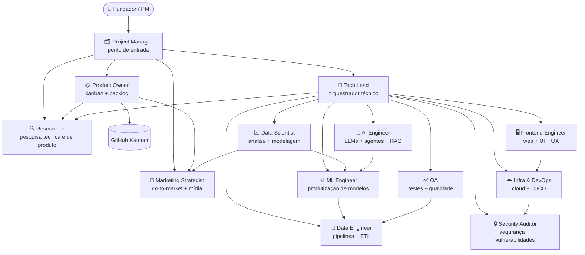

# Equipe de Agentes

Este projeto usa uma equipe de 13 agentes especializados. O ponto de entrada padrão é o `project-manager`.

## Time

| Agente | Responsabilidade |
|---|---|
| `project-manager` | Ponto de entrada — delega, consolida resultados, apresentações e relatórios |
| `tech-lead` | Orquestrador técnico, code review, dono da documentação técnica |
| `product-owner` | Kanban, backlog, roadmap, priorização |
| `data-engineer` | Pipelines, ETL, qualidade de dados |
| `data-scientist` | Análise exploratória, contexto estatístico, insights para editorial e produto |
| `ml-engineer` | Modelos, features, experimentos |
| `ai-engineer` | LLMs, agentes, RAG, evals |
| `infra-devops` | Cloud, CI/CD, containers |
| `qa` | Testes unitários, integração, e2e |
| `researcher` | Pesquisa técnica e de produto, benchmarks, inteligência competitiva |
| `security-auditor` | Segurança, vulnerabilidades |
| `frontend-engineer` | Web, UI, UX |
| `marketing-strategist` | Marketing, go-to-market, canais, publicidade, mídias |

## Arquitetura

## Contexto obrigatório antes de agir

**`project-manager` e `product-owner`** leem, nesta ordem:

1. `.claude/memory/MEMORY.md` — índice da memória persistente
2. `.claude/memory/user_profile.md` — trajetória, preferências e objetivos do fundador
3. `.claude/memory/project_genesis.md` — motivação fundadora, ancoragens estratégicas, exclusões
4. `.claude/memory/project_history.md` — changelog humano — decisões, entregáveis, restrições
5. Estado do Kanban via `gh project item-list`
6. `git log --oneline -10` — últimos commits

**`tech-lead`** lê:

1. `.claude/memory/MEMORY.md` — índice da memória persistente (inclui referências a guidelines do projeto)
2. `.claude/memory/project_genesis.md` — contexto do projeto
3. `docs/kickoff/kickoff.md` (se existir) — problem statement e backlog aprovados
4. `git log --oneline -10` — últimos commits

**Todos os demais agentes** leem apenas:

1. `git log --oneline -10` — últimos commits

Os arquivos de memória são criados na **Fase 0 do `/kickoff`** e atualizados via `/update-memory`. Se algum arquivo contradisser a instrução recebida, o agente **pára e reporta** — não resolve silenciosamente.

## Kanban e GitHub Project

- Toda issue é **vinculada ao Project** no momento da criação (`gh project item-add`) — sem isso não aparece no board.
- Labels (dimensão + prioridade) são pré-criadas no `setup-kanban.yml`.
- Nenhum entregável é produzido sem issue aberta em "In Progress".
- Especialistas movem o próprio card: `In Progress` ao iniciar, `In Review` ao concluir.
- Especialistas **nunca criam issues** — se perceberem lacuna no backlog, sinalizam ao product-owner no relatório de entrega.

## Fluxo de Kanban

| Papel | Agente | Permissões |
|---|---|---|
| Dono | `product-owner` | cria, fecha, move qualquer card, árbitro final |
| Leitor obrigatório | `project-manager` | lê o kanban antes de toda delegação |
| Criador de issues | `project-manager`, `product-owner` | abrem issues novas |
| Atualizador | todos os especialistas | move o próprio card para `In Progress` e `In Review` |
| Fechador | `product-owner` + `tech-lead` | movem para `Done` após aprovação |

## Fluxo de Código e PR

| Etapa | Responsável |
|---|---|
| Escrever código | agente especialista da tarefa |
| Abrir PR | agente especialista que implementou |
| Code review | `tech-lead` — sempre |
| Security review | `security-auditor` — PRs com infra, auth ou dados sensíveis |
| QA review | `qa` — valida cobertura de testes |
| Aprovar PR | `tech-lead` |
| Merge | `tech-lead`; `infra-devops` em PRs de CI/CD quando delegado |
| Fechar issue | `product-owner` após merge |

Regra central: **nenhum agente faz merge do próprio trabalho sem aprovação do `tech-lead`**.

## Fluxo de Aprovação por Tipo de Artefato

| Tipo de artefato | Exemplos | Revisão e aprovação |
|---|---|---|
| Código | PRs de feature, fix, infra | `tech-lead` |
| Docs internos | pitch, personas, roadmap, arquitetura | `project-manager` |
| Copy / editorial | texto de slide, legenda, narrativa | `project-manager` + `product-owner` |
| Artefato de publicação | PDF público, post em mídia, apresentação externa | `marketing-strategist` valida e publica; escala para `tech-lead` se bug de renderização |

Regra central: **artefatos que saem da organização passam obrigatoriamente pelo `marketing-strategist` antes da publicação**.

## Versionamento e geração de documentos

- Entregáveis em `docs/` seguem `{nome}_YYYY-MM-DD_v{N}.md`. Ao revisar, o agente move o anterior para `archive/` e grava `_v{N+1}.md` — **nunca sobrescreve**.
- MDs ganham contraparte em PDF/DOCX/PPTX via `node scripts/generate_docs.js` (saída em `docs//generated/`, espelhando a estrutura, inclusive `archive/`).

## Como Acionar Agentes

O `project-manager` delega via `Task` tool. Exemplo:

> "Invoque o `data-engineer` para executar a issue #14"

Os agentes só são acionados dentro de um `/comando` ativo. Fora de comando, o project-manager apenas conversa.
